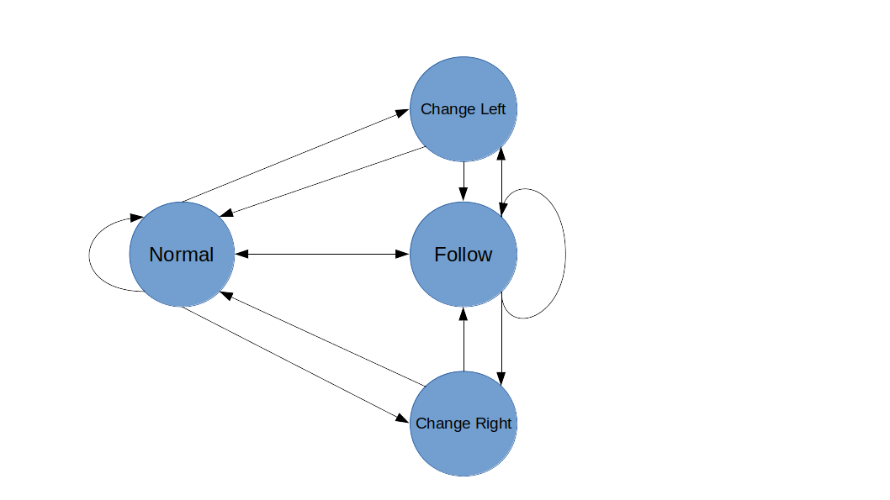

# CarND-Path-Planning-Project

This repository contains all the code for the final project for the Path Planning course in Udacity's Self-Driving Car Nanodegree.

**To view the video on YouTube, click the following image: **

[](https://youtu.be/nmwZVvpNceo) 

## Goals
In this project your goal is to safely navigate around a virtual highway with other traffic that is driving +-10 MPH of the 50 MPH speed limit. You will be provided the car's localization and sensor fusion data, there is also a sparse map list of waypoints around the highway. The car should try to go as close as possible to the 50 MPH speed limit, which means passing slower traffic when possible, note that other cars will try to change lanes too. The car should avoid hitting other cars at all cost as well as driving inside of the marked road lanes at all times, unless going from one lane to another. The car should be able to make one complete loop around the 6946m highway. Since the car is trying to go 50 MPH, it should take a little over 5 minutes to complete 1 loop. Also the car should not experience total acceleration over 10 m/s^2 and jerk that is greater than 10 m/s^3.

The goal of this project is to build a path planner that creates smooth, safe trajectories for the car to follow. The highway track has other vehicles, all going different speeds, but approximately obeying the 50 MPH speed limit.

The car transmits its location, along with its sensor fusion data, which estimates the location of all the vehicles on the same side of the road.


### Point Paths

The path planner should output a list of x and y global map coordinates. Each pair of x and y coordinates is a point, and all of the points together form a trajectory. You can use any number of points that you want, but the x list should be the same length as the y list.

Every 20 ms the car moves to the next point on the list. The car's new rotation becomes the line between the previous waypoint and the car's new location.

The car moves from point to point perfectly, so you don't have to worry about building a controller for this project.

The animation above shows how the car moves and rotates through a given list of points.

### Velocity

The velocity of the car depends on the spacing of the points. Because the car moves to a new waypoint every 20ms, the larger the spacing between points, the faster the car will travel. The speed goal is to have the car traveling at (but not above) the 50 MPH speed limit as often as possible. But there will be times when traffic gets in the way.

### Simulator.

You can download the Term3 Simulator which contains the Path Planning Project from the [releases tab (https://github.com/udacity/self-driving-car-sim/releases/tag/T3_v1.2).  

To run the simulator on Mac/Linux, first make the binary file executable with the following command:
```shell
sudo chmod u+x {simulator_file_name}
```

## State Machine



The state machine considers four states: 

- Normal
- Follow
- Change Left
- Change Right

```c++
// State Machine Setup
  fsm.add_transitions({
    //  from state ,to state ,triggers, guard ,action                                       
    { States::Normal      ,States::ChangeLeft  ,Triggers::CarAhead ,[&]{return car_ahead && !car_left && lane > 0;}    ,[&]{lane--;} },
    { States::ChangeLeft  ,States::Normal      ,Triggers::Clear    ,[&]{return !car_ahead;}                                    ,[&]{} },
    { States::ChangeLeft  ,States::Follow      ,Triggers::CarAhead ,[&]{return car_ahead;}                                     ,[&]{ ref_vel -= speed_diff; } },
    { States::Follow      ,States::ChangeLeft  ,Triggers::CarAhead ,[&]{return car_ahead && !car_left && lane > 0;}    ,[&]{lane--;} },

    { States::Normal      ,States::ChangeRight ,Triggers::CarAhead ,[&]{return car_ahead && !car_right && lane != 2;} ,[&]{lane++;} },
    { States::ChangeRight ,States::Normal      ,Triggers::Clear    ,[&]{return !car_ahead;}                                    ,[&]{} },
    { States::ChangeRight ,States::Follow      ,Triggers::CarAhead ,[&]{return car_ahead;}                                     ,[&]{ ref_vel -= speed_diff; } },
    { States::Follow      ,States::ChangeRight ,Triggers::CarAhead ,[&]{return car_ahead && !car_right && lane != 2;} ,[&]{lane++;} },

    { States::Normal      ,States::Follow      ,Triggers::CarAhead ,[&]{return true;}                                          ,[&]{ref_vel -= speed_diff;} },
    { States::Follow      ,States::Follow      ,Triggers::CarAhead ,[&]{return true;}                                          ,[&]{ref_vel -= speed_diff;} },
    { States::Follow      ,States::Normal      ,Triggers::Clear    ,[&]{return !car_ahead;}                                    ,[&]{ref_vel += speed_diff;} },
    { States::Normal      ,States::Normal      ,Triggers::Clear    ,[&]{return !car_ahead;}                                    ,[&]{ if (ref_vel < max_vel) { ref_vel += speed_diff; }} },

  }); // end fsm.add_transitions
```


### Getting Started

Start by simply trying to move the car forward in a straight line at a constant 50 MPH velocity. Use the car's (x, y) localization information and its heading direction to create a simple, straight path that is drawn directly in front of the car.

In `main.cpp`, instead of setting the speed directly, we pass `next_x_vals`, and `next_y_vals` to the simulator. We will set the points 0.5 m apart. Since the car moves 50 times a second, a distance of 0.5m per move will create a velocity of 25 m/s. 25 m/s is close to 50 MPH.

```cpp
double dist_inc = 0.5;
for (int i = 0; i < 50; ++i) {
  next_x_vals.push_back(car_x+(dist_inc*i)*cos(deg2rad(car_yaw)));
  next_y_vals.push_back(car_y+(dist_inc*i)*sin(deg2rad(car_yaw)));
}
```


Great! With just a couple of lines of code we were able to get the car to drive forward at constant velocity.

Notice, however, that the car went from 0 MPH to 56 MPH in a single 20 ms frame, causing a spike in acceleration.

Acceleration is calculated by comparing the rate of change of average speed over .2 second intervals. In this case total acceleration at one point was as high as 75 m/s^2. Jerk was also very high. The jerk is calculated as the average acceleration over 1 second intervals. In order for the passenger to have an enjoyable ride both the jerk and the total acceleration should not exceed 10 m/s^2.

Part of the total acceleration is the normal component, *AccN* which measures the centripetal acceleration from turning. The tighter and faster a turn is made, the higher the *AccN* value will be.

In our simple test we were not turning at all, so the value of *AccN* was zero.

Going forward, consider how to minimize total acceleration and jerk by gradually increasing and decreasing point path spacing based on the `car_speed` variable.

To get a better idea of how movement affects the acceleration of the car, click the *Manual Mode* check box in the top left of the simulator screen to drive the car around yourself.

### More Complex Paths

In the previous concept you moved the car forward in a straight line. How about creating more interesting paths?


[Driving the car in a circular path](https://classroom.udacity.com/nanodegrees/nd013/parts/30260907-68c1-4f24-b793-89c0c2a0ad32/modules/b74b8e43-47d1-47d6-a4cf-4d64ea3e0b80/lessons/407a2efa-3383-480f-9266-5981440b09b3/concepts/66b03ee0-8e28-4a20-a1b2-690801d57d06#)


```cpp
vector<double> next_x_vals;
vector<double> next_y_vals;

double pos_x;
double pos_y;
double angle;
int path_size = previous_path_x.size();

for (int i = 0; i < path_size; ++i) {
  next_x_vals.push_back(previous_path_x[i]);
  next_y_vals.push_back(previous_path_y[i]);
}

if (path_size == 0) {
  pos_x = car_x;
  pos_y = car_y;
  angle = deg2rad(car_yaw);
} else {
  pos_x = previous_path_x[path_size-1];
  pos_y = previous_path_y[path_size-1];

  double pos_x2 = previous_path_x[path_size-2];
  double pos_y2 = previous_path_y[path_size-2];
  angle = atan2(pos_y-pos_y2,pos_x-pos_x2);
}

double dist_inc = 0.5;
for (int i = 0; i < 50-path_size; ++i) {    
  next_x_vals.push_back(pos_x+(dist_inc)*cos(angle+(i+1)*(pi()/100)));
  next_y_vals.push_back(pos_y+(dist_inc)*sin(angle+(i+1)*(pi()/100)));
  pos_x += (dist_inc)*cos(angle+(i+1)*(pi()/100));
  pos_y += (dist_inc)*sin(angle+(i+1)*(pi()/100));
}

msgJson["next_x"] = next_x_vals;
msgJson["next_y"] = next_y_vals;
```


#### Using Previous Path Points

The code snippet above builds a 50 point path, as in the previous experiment. But this code snippet starts the new path with whatever previous path points were left over from the last cycle. Then we append new waypoints, until the new path has 50 total waypoints.

Using information from the previous path ensures that there is a smooth transition from cycle to cycle. But the more waypoints we use from the previous path, the less the new path will reflect dynamic changes in the environment.

Ideally, we might only use a few waypoints from the previous path and then generate the rest of the new path based on new data from the car's sensor fusion information.

#### Timing

The simulator runs a cycle every 20 ms (50 frames per second), but your C++ path planning program will provide a new path at least one 20 ms cycle behind. The simulator will simply keep progressing down its last given path while it waits for a new generated path.

This means that using previous path data becomes even more important when higher latency is involved. Imagine, for instance, that there is a 500ms delay in sending a new path to the simulator. As long as the new path incorporates a sufficient length of the previous path, the transition will still be smooth.

A concern, though, is how accurately we can predict other traffic 1-2 seconds into the future. An advantage of newly generated paths is that they take into account the most up-to-date state of other traffic.

#### Setting Point Paths with Latency

As a mentioned, your C++ path planner will at the very least be one cycle behind the simulator because the C++ program can't receive and send data on the same cycle. As a result, any path that the simulator receives will be from the perspective of a previous cycle. This might mean that by the time a new path reaches the simulator, the vehicle has already passed the first few waypoints on that path.

Luckily you don't have to worry about this too much. The simulator has built-in tools to deal with this timing difference. The simulator actually expects the received path to be a little out of date compared to where the car is, and the simulator will consider which point on the received path is closest to the car and adjust appropriately.

### Sensor Fusion

It's important that the car doesn't crash into any of the other vehicles on the road, all of which are moving at different speeds around the speed limit and can change lanes.

The `sensor_fusion` variable contains all the information about the cars on the right-hand side of the road.

The data format for each car is: [ id, x, y, vx, vy, s, d]. The id is a unique identifier for that car. The x, y values are in global map coordinates, and the vx, vy values are the velocity components, also in reference to the global map. Finally s and d are the Frenet coordinates for that car.

The vx, vy values can be useful for predicting where the cars will be in the future. For instance, if you were to assume that the tracked car kept moving along the road, then its future predicted Frenet s value will be its current s value plus its (transformed) total velocity (m/s) multiplied by the time elapsed into the future (s).

### Changing Lanes


[Creating paths with smooth lane changes](https://classroom.udacity.com/nanodegrees/nd013/parts/30260907-68c1-4f24-b793-89c0c2a0ad32/modules/b74b8e43-47d1-47d6-a4cf-4d64ea3e0b80/lessons/407a2efa-3383-480f-9266-5981440b09b3/concepts/bc45c809-0e43-4bf6-91b6-6176eee78acd#)


The last consideration is how to create paths that can smoothly changes lanes. Any time the ego vehicle approaches a car in front of it that is moving slower than the speed limit, the ego vehicle should consider changing lanes.

The car should only change lanes if such a change would be safe, and also if the lane change would help it move through the flow of traffic better.

For safety, a lane change path should optimize the distance away from other traffic. For comfort, a lane change path should also result in low acceleration and jerk. The acceleration and jerk part can be solved from linear equations for s and d functions. Examples of this can be found in the Trajectory Generation quizzes entitled, "Quintic Polynomial Solver" and "Polynomial Trajectory".

The provided Eigen-3.3 library can solve such linear equations. The `getXY` helper function can transform (s,d) points to (x,y) points for the returned path.

### The map of the highway is in data/highway_map.txt

Each waypoint in the list contains  [x,y,s,dx,dy] values. x and y are the waypoint's map coordinate position, the s value is the distance along the road to get to that waypoint in meters, the dx and dy values define the unit normal vector pointing outward of the highway loop.

The highway's waypoints loop around so the frenet s value, distance along the road, goes from 0 to 6945.554.

## Basic Build Instructions

1. Clone this repo.
2. Make a build directory: `mkdir build && cd build`
3. Compile: `cmake .. && make`
4. Run it: `./path_planning`.

Here is the data provided from the Simulator to the C++ Program

#### Main car's localization Data (No Noise)

["x"] The car's x position in map coordinates

["y"] The car's y position in map coordinates

["s"] The car's s position in frenet coordinates

["d"] The car's d position in frenet coordinates

["yaw"] The car's yaw angle in the map

["speed"] The car's speed in MPH

#### Previous path data given to the Planner

//Note: Return the previous list but with processed points removed, can be a nice tool to show how far along the path has processed since last time. 

["previous_path_x"] The previous list of x points previously given to the simulator

["previous_path_y"] The previous list of y points previously given to the simulator

#### Previous path's end s and d values 

["end_path_s"] The previous list's last point's frenet s value

["end_path_d"] The previous list's last point's frenet d value

#### Sensor Fusion Data, a list of all other car's attributes on the same side of the road. (No Noise)

["sensor_fusion"] A 2d vector of cars and then that car's [car's unique ID, car's x position in map coordinates, car's y position in map coordinates, car's x velocity in m/s, car's y velocity in m/s, car's s position in frenet coordinates, car's d position in frenet coordinates. 

## Details

1. The car uses a perfect controller and will visit every (x,y) point it receives in the list every .02 seconds. The units for the (x,y) points are in meters and the spacing of the points determines the speed of the car. The vector going from a point to the next point in the list dictates the angle of the car. Acceleration both in the tangential and normal directions is measured along with the jerk, the rate of change of total Acceleration. The (x,y) point paths that the planner receives should not have a total acceleration that goes over 10 m/s^2, also the jerk should not go over 50 m/s^3. (NOTE: As this is BETA, these requirements might change. Also currently jerk is over a .02 second interval, it would probably be better to average total acceleration over 1 second and measure jerk from that.

2. There will be some latency between the simulator running and the path planner returning a path, with optimized code usually its not very long maybe just 1-3 time steps. During this delay the simulator will continue using points that it was last given, because of this its a good idea to store the last points you have used so you can have a smooth transition. previous_path_x, and previous_path_y can be helpful for this transition since they show the last points given to the simulator controller with the processed points already removed. You would either return a path that extends this previous path or make sure to create a new path that has a smooth transition with this last path.

## Tips

A really helpful resource for doing this project and creating smooth trajectories was using http://kluge.in-chemnitz.de/opensource/spline/, the spline function is in a single header file is really easy to use.

---

## Dependencies

* cmake >= 3.5
  
  * All OSes: [click here for installation instructions](https://cmake.org/install/)
* make >= 4.1
  * Linux: make is installed by default on most Linux distros
  * Mac: [install Xcode command line tools to get make](https://developer.apple.com/xcode/features/)
  * Windows: [Click here for installation instructions](http://gnuwin32.sourceforge.net/packages/make.htm)
* gcc/g++ >= 5.4
  * Linux: gcc / g++ is installed by default on most Linux distros
  * Mac: same deal as make - [install Xcode command line tools]((https://developer.apple.com/xcode/features/)
  * Windows: recommend using [MinGW](http://www.mingw.org/)
* [uWebSockets](https://github.com/uWebSockets/uWebSockets)
  * Run either `install-mac.sh` or `install-ubuntu.sh`.
  * If you install from source, checkout to commit `e94b6e1`, i.e.
    ```
    git clone https://github.com/uWebSockets/uWebSockets 
    cd uWebSockets
    git checkout e94b6e1
    ```


